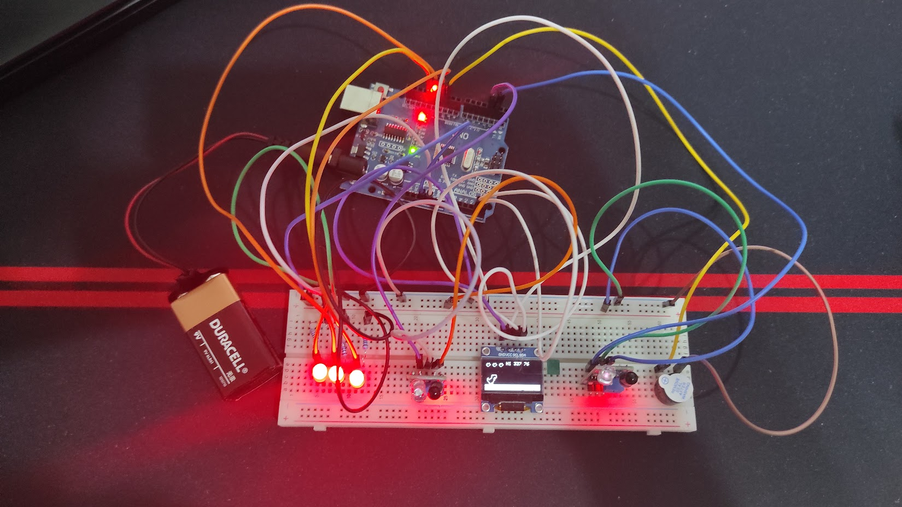
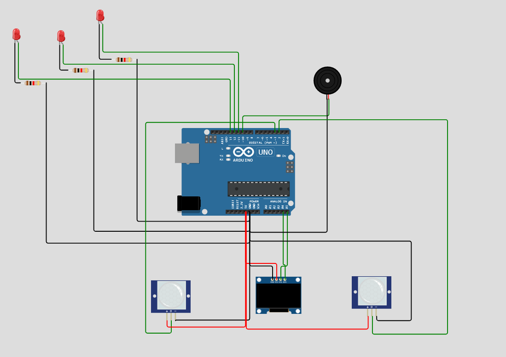

<!--- insert project logo here -->

<!--- general description of the project -->
T-Rex Dyno is an endless runner type game, drawing inspiration from the mini-game provided by Google Chrome's browser during an Internet outage. The primary objective for the user is to evade obstacles, and as they advance, their score will continue to rise.
This game is an Arduino Uno project aiming to replicate the immersive experience of playing on a handheld device, employing innovative input methods. This project is a third year student assignment for the Microprocessors Design course. For the full project specifications visit the following [link](https://ocw.cs.pub.ro/courses/pm/prj2022/ndrogeanu/dyno).

## :trophy: Features
  &nbsp;&nbsp; :small_orange_diamond: Proximity based input detection  
  &nbsp;&nbsp; :small_orange_diamond: Day-night cycles  
  &nbsp;&nbsp; :small_orange_diamond: Persistent highest score  
  &nbsp;&nbsp; :small_orange_diamond: Life pickups

## :nut_and_bolt: Components
  &nbsp;&nbsp; :small_blue_diamond: Arduino Uno   
  &nbsp;&nbsp; :small_blue_diamond: Breadboard  
  &nbsp;&nbsp; :small_blue_diamond: SH-1106 OLED display  
  &nbsp;&nbsp; :small_blue_diamond: 2 x IR HW-201 infrared sensors  
  &nbsp;&nbsp; :small_blue_diamond: Active buzzer    
  &nbsp;&nbsp; :small_blue_diamond: 3 x LEDs  
  &nbsp;&nbsp; :small_blue_diamond: 9V battery  
  
  
## :gem: Demo
  

## :page_facing_up: License
This project is available under the [MIT][ref-mit] license; see [LICENSE](LICENSE) for the full license text.

[ref-mit]:              https://opensource.org/licenses/MIT
